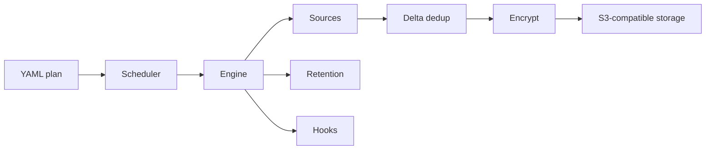

# backupd

**backupd** is a declarative, S3-compatible backup daemon. You define backup plans in a single
YAML file — sources, destination, encryption, retention, tags, and hooks — and backupd handles
the rest.

## Features

- **Declarative YAML config** with `${ENV_VAR}` interpolation
- **S3-compatible storage** — AWS S3, MinIO, DigitalOcean Spaces, Backblaze B2
- **Incremental backups** via an rsync-style delta algorithm that only uploads changed blocks
- **Multiple source types** — file paths, databases (PostgreSQL, MySQL, MongoDB, SQLite), Docker
  volumes, and Kubernetes PVCs
- **AES-256-GCM encryption** with Argon2id key derivation
- **Retention policies** — keep-last, daily, weekly, monthly
- **Pre/post/on-failure command hooks** for notification and orchestration
- **Embedded cron scheduler** and systemd timer/service export
- **Snapshot integrity verification**
- **Shell completion** for bash, zsh, and fish

## How it works



Each backup produces a snapshot — an immutable, versioned set of objects in your bucket. Restores
pull the manifest and reconstruct files from the stored blocks.

## Getting started

```shell
go install github.com/soroushalinia/backupd/cmd/backupd@latest
```

Check out the [Quick Start](quickstart.md) or the full [Configuration](configuration.md) reference.
